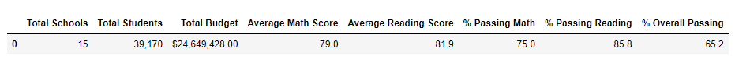
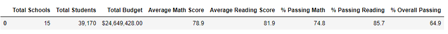
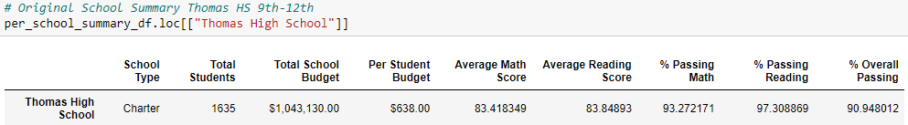
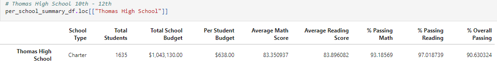
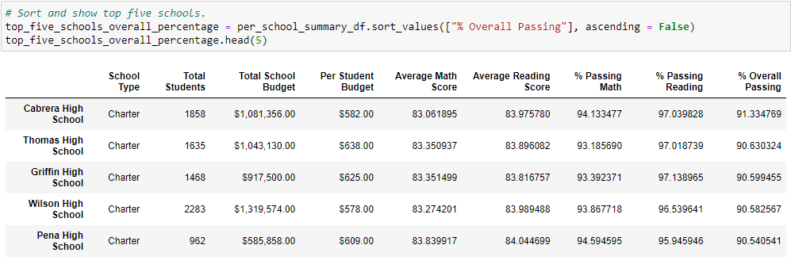
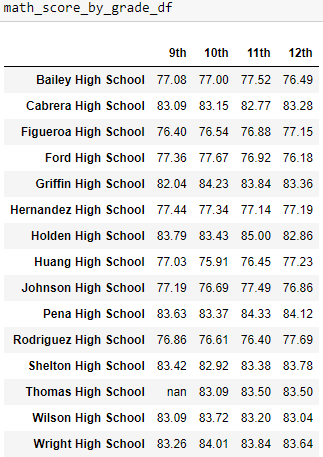
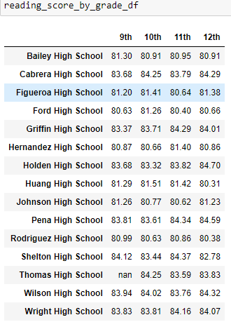

# School District Analysis

## Overview

Assist Maria in analyzing 15 schools in the city school district. We compared schools by math & reading scores, size, budget, & type (Charter vs District).

We also investigated claim against Thomas High School's 9th graders and adjusted Thomas High School's statistics by removing their 9th graders scores.

## Results
- How is the district summary affected?
  - Original District Summary

  - Fixed District Summary

  - The district summary was not affected very much, but there were small changes. 
    - The Overall Passing Percentage dropped by 0.3%, from 65.2% to 64.9%.
    - The Average Math Score fell from 79 to 78.9.
    - The Average Reading Score stayed at 81.9.
    - The % Passing Math dropped from 75% to 74.8%.
    - The % Passing Reading dropped from 85.8% to 85.7%.
- How is the school summary affected?
  - Original School Summary Thomas HS 9-12th

  - Adjusted Thomas HS Summary  10th - 12th

  - Thomas HS Average Math Score dropped from 83.42 to 83.35
  - Thomas HS Average Reading Score rose from 83.85 to 83.90
  - Thomas HS % Passing Math dropped from 93.27% to 93.19% 
  - Thomas HS % Passing Reading fell from 97.31% to 97.02%
  - Thomas HS % Overall Passing dropped from 90.95% to 90.63%
- How does replacing the ninth graders’ math and reading scores affect Thomas High School’s performance relative to the other schools?
  - Thomas HS average grades & passing percentages changed, but the school remains the #2 performing school in the district

- How does replacing the ninth-grade scores affect the following:
  - Math and reading scores by grade
    - Thomas HS shows "nan" in the 9th grade slot for reading & math score dataframes.
      - 
      - 
  - Scores by school spending
    - Removing the Thomas HS 9th grade scores was not enough to change the district average scores and passing percentages when looking at school spending.
  - Scores by school size
    - Removing the Thomas HS 9th grade scores was not enough to change the district average scores and passing percentages when checking school sizes.
  - Scores by school type
    - Removing the Thomas HS 9th grade scores was not enough to change the district average scores and passing percentages when comparing school types.

## Summary

The changes to the updated school district analysis were fairly negligible. The average math score changed from 79.0 to 78.9 and the average reading score stayed at 81.9. The % passing math fell by 0.2% and the % passing reading dropped by 0.1%. Finally, the overall passing % went from 65.2% to 64.9%.

By comparison, the changes in Thomas High School's own School Summary changed by larger degrees. But even then the changes were 10ths of a percent.

